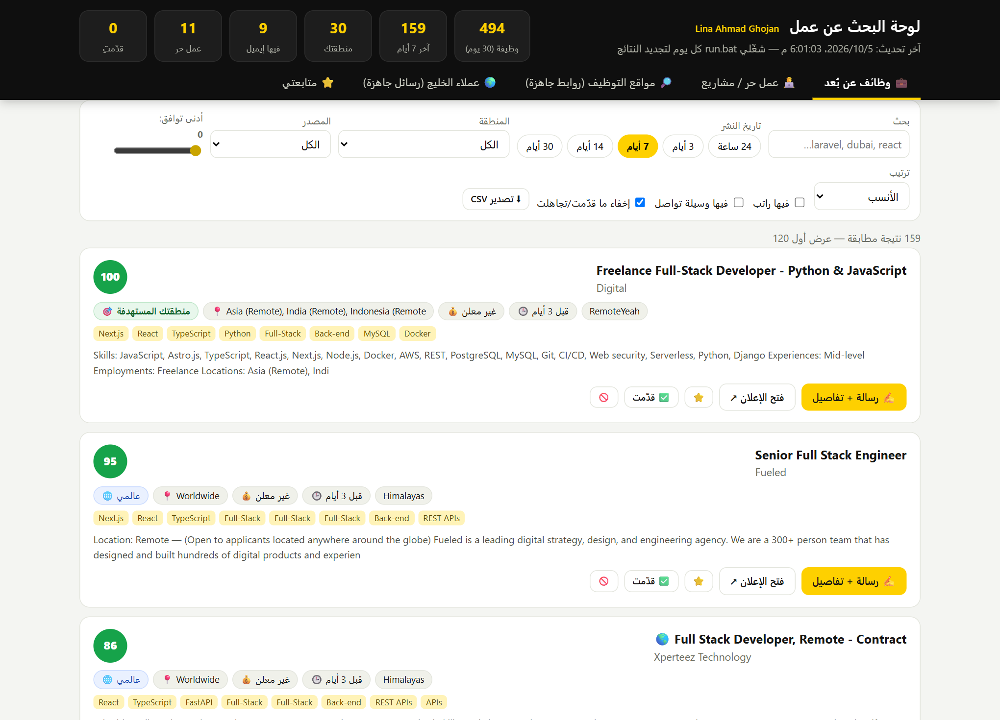
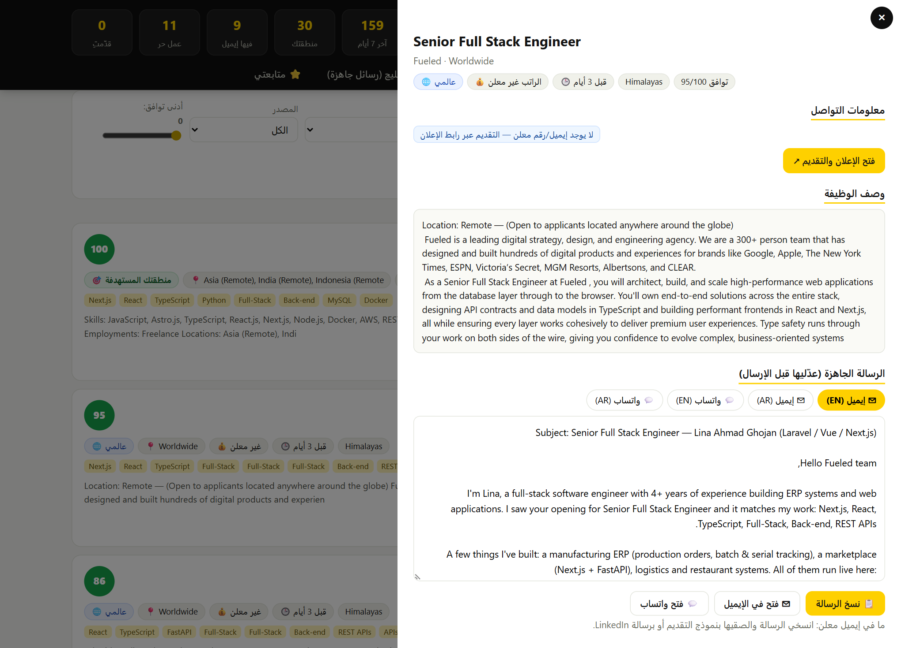
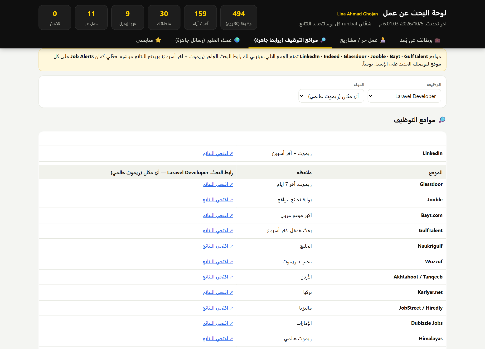
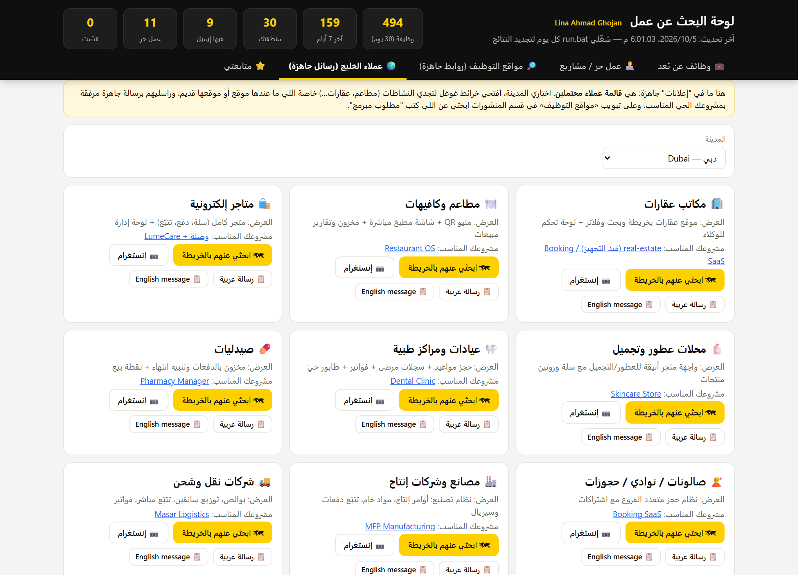
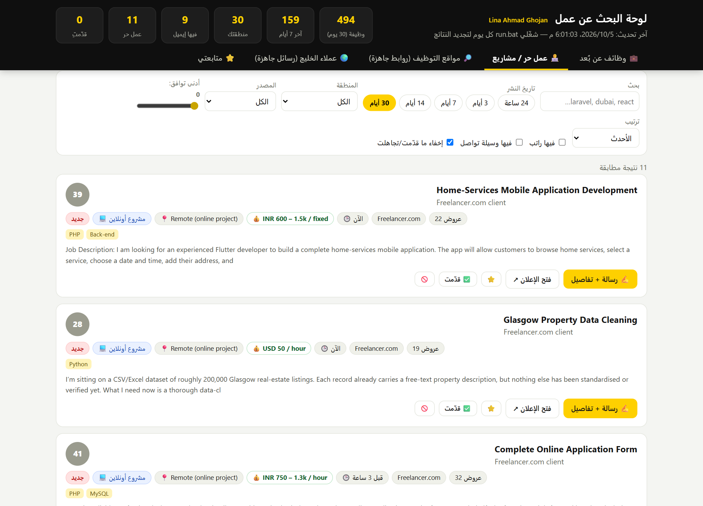

# Job Hunt — remote jobs & freelance leads dashboard

A small personal tool that finds **remote** developer jobs and freelance work that fit a CV, ranks them, and shows them in a clean web dashboard — with a ready-to-send application message for every job.

Built for a Laravel / Vue.js / Next.js / FastAPI engineer (ERP background) who wants remote work from anywhere, with a focus on **Gulf countries, Jordan, Turkey and Malaysia**.

> أداة شخصية بتجمع وظائف **ريموت** وفرص عمل حر مناسبة للسيرة الذاتية، وبترتّبها حسب التوافق، وبتعرضها بلوحة ويب مع **رسالة تقديم جاهزة** لكل وظيفة. (الشرح بالعربي أسفل الصفحة)

## Screenshots

| Jobs (ranked, filtered, last 7 days) | Message generator (EN / AR, email / WhatsApp) |
|---|---|
|  |  |

| 60+ job boards — one-click searches | Gulf client leads + outreach messages |
|---|---|
|  |  |



## What it does

1. **Reads the CV** (`cv/cv.docx`) and detects which skills it contains (Laravel, Vue, Next.js, FastAPI, ERP…); those skills drive the scoring.
2. **Collects jobs** from public, no-login sources (official APIs / RSS):
   Himalayas · Working Nomads · RemoteYeah · VueJobs · LaraJobs · We Work Remotely · RemoteOK · Remotive · Jobicy · Python.org · NoDesk · Hacker News *Who is hiring* (many with a direct e-mail) — and freelance projects from Freelancer.com and Reddit.
   Optional: **Jooble** and **Adzuna** APIs (free keys) for Gulf / Turkey / Malaysia boards.
3. **Filters hard**: remote only, relevant to the CV, not too senior, not older than 30 days, and **location-eligible** — it keeps *worldwide / anywhere* and the target regions (UAE, Saudi, Qatar, Kuwait, Bahrain, Oman, Jordan, Turkey, Malaysia, MENA/EMEA) and drops “US only / EU only / LATAM only…”.
4. **Scores** each job 0–100 (skill match, region, freshness, salary shown, contact available) and removes duplicates.
5. **Extracts** salary ranges and contact details (e-mail, WhatsApp, phone) when the ad includes them.
6. **Dashboard** (`site/index.html`, no server needed):
   - filters: posted within 24h / 3 / 7 / 14 / 30 days, region, source, min score, has salary, has contact, search box, sort;
   - per job: position, company, location restriction, salary range, matched skills, contacts, apply link;
   - **message generator**: e-mail or WhatsApp, English or Arabic, filled with the job title / company / matching skills, with copy, “open in mail” and “open WhatsApp” buttons;
   - status tracking (saved / applied / skipped) stored in the browser, CSV export;
   - **Job boards tab**: ready-made search links (remote + last 7 days) for LinkedIn, Indeed, Glassdoor, Jooble, Bayt, GulfTalent, Naukrigulf, Monster, Wuzzuf, Kariyer, JobStreet… and for freelance sites (Mostaql, Upwork, Freelancer, Fiverr…);
   - **Gulf clients tab**: business segments (real estate, restaurants, e-commerce, perfume shops, clinics, factories…) with Google-Maps search per city and a ready outreach message that links to the matching live demo.

### What it does *not* do
LinkedIn, Indeed, Glassdoor, Bayt and GulfTalent forbid scraping, so the tool does not scrape them — it builds the search link for you. Turn on their **Job Alerts** for daily e-mails. Many employers cannot hire from every country (e.g. sanctions), so check eligibility before applying.

## Run it

```bash
npm install            # one dependency: adm-zip (reads the .docx CV)
node collect.mjs       # or double-click run.bat on Windows
# then open site/index.html
```

Options: `node collect.mjs --cv path/to/cv.docx --days 30 --max 700 --only himalayas,remoteok --debug`

Optional keys: `JOOBLE_KEY`, `ADZUNA_ID`, `ADZUNA_KEY`.

Edit **`profile.json`** to change keywords, target countries, excluded titles/words and the message templates. Run it every day (Windows scheduler example):

```
schtasks /Create /SC DAILY /ST 09:00 /TN JobHunt /TR "node C:\path\to\jobhunt\collect.mjs"
```

## Files

| File | Purpose |
|---|---|
| `collect.mjs` | reads the CV, runs all sources, filters, scores, writes `data/jobs.json` and `site/data.js` |
| `sources.mjs` | one function per job source (add your own here) |
| `util.mjs` | HTTP, RSS parser, contact / salary extraction |
| `profile.json` | skills, regions, filters, message templates |
| `site/` | the static dashboard (`index.html`, `app.js`, `boards.js`, `style.css`) |

---

## بالعربي — شو بتعمل الأداة؟

1. **بتقرأ السيرة الذاتية** (`cv/cv.docx`) وبتعرف مهاراتك (Laravel, Vue, Next.js, FastAPI, ERP…).
2. **بتجمع الوظائف** من مصادر عامة بدون تسجيل (Himalayas، Working Nomads، RemoteYeah، VueJobs، LaraJobs، We Work Remotely، RemoteOK، Remotive، Jobicy، Hacker News…) ومشاريع العمل الحر (Freelancer، Reddit).
3. **بتفلتر**: ريموت فقط، مناسبة للسيرة، مو أقدم من 30 يوم، ومنطقتها مقبولة — بتبقي "من أي مكان" ودول الخليج والأردن وتركيا وماليزيا، وبتستبعد "أمريكا فقط / أوروبا فقط…".
4. **بتعطي درجة توافق من 100** وبتشيل المكرر، وبتستخرج **الراتب** وطرق **التواصل** (إيميل / واتساب / رقم) لما تكون بالإعلان.
5. **لوحة الويب**: فلاتر (تاريخ النشر 24 ساعة…30 يوم)، المسمّى الوظيفي، الشركة، الراتب، التواصل، **رسالة جاهزة** (إيميل/واتساب بالعربي والإنجليزي) مع أزرار نسخ وفتح، متابعة (محفوظ/قدّمت/تجاهل)، وتبويب لروابط بحث جاهزة لأكثر من 60 موقع توظيف، وتبويب لعملاء الخليج مع رسائل تواصل.

**ملاحظة:** LinkedIn وIndeed وGlassdoor وBayt وGulfTalent بتمنع الجمع الآلي، فالأداة بتبني لك رابط البحث وبتفتحه مباشرة، وفعّلي التنبيهات (Job Alerts) عليها.
